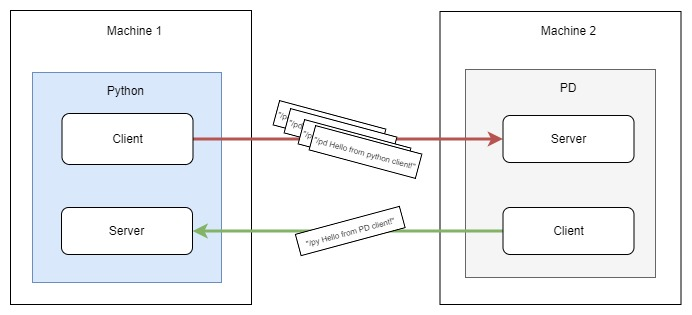
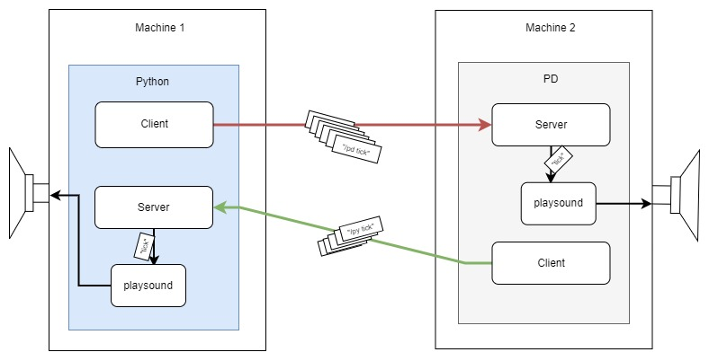
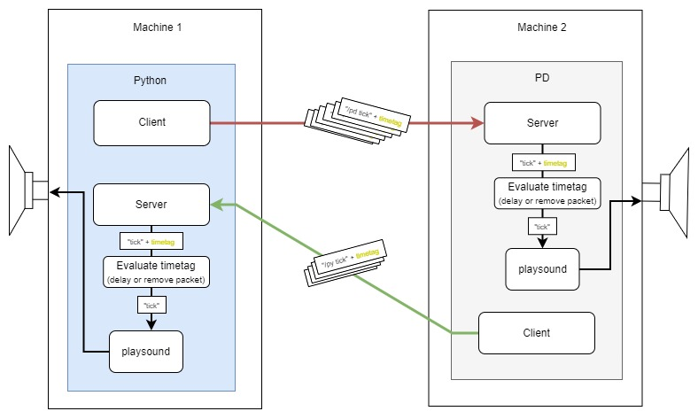
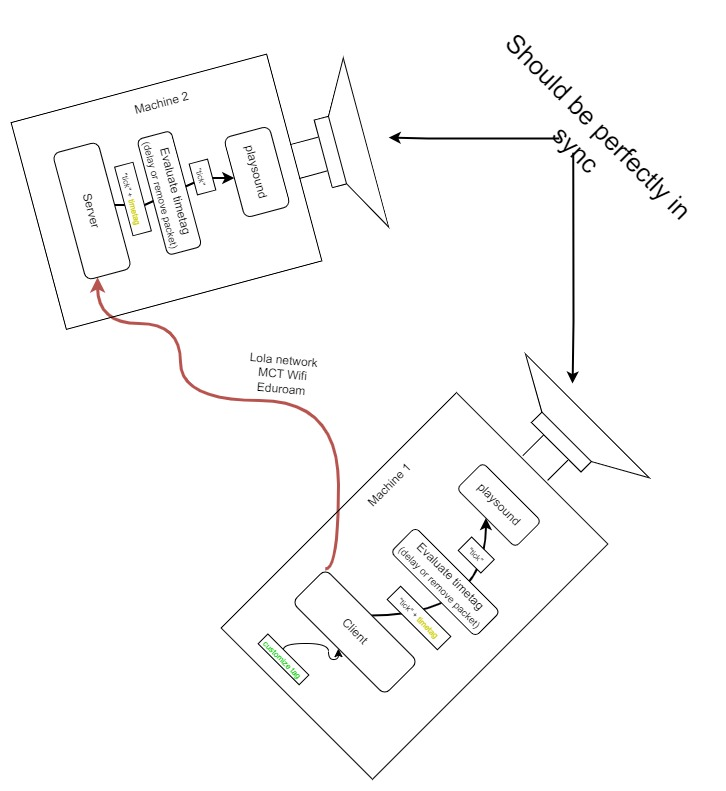

# Networked Device Control and Synchronization With OSC

Today, we will continue to explore synchronous online musical collaboration, but this time using Pure Data and Python. The students will learn how to use OSC timetags to synchronize and control audio in networked contexts.

The goal is to learn more about how to set up and configure advanced technologies for networked music systems and synchronous online musical collaboration.

## Preperation

Schmeder, & Freed, A. (2008). Implementation and applications of open sound control timestamps. ICMC. http://cnmat.berkeley.edu/publications/implementation-and-applications-open-sound-control-timestampsLinks to an external site.

Andrew Schmeder. (2010). Best Practices for Open Sound Control. Center for New Music and Audio Technologies (CNMAT), UC Berkeley. https://opensoundcontrol.stanford.edu/files/osc-best-practices-final.pdfLinks to an external site.

## Dependencies

- [ Python 3x](https://www.python.org/downloads/)

  ```
  pip install playsound==1.2.2
  pip install python-osc
  ```

- [Pure Data Vanilla 0.54](https://puredata.info/downloads/pure-data)
  - **It's important** that you have the 32-bit version of Pure Data vanilla.
  - Download the [mrpeach](https://github.com/pd-externals/mrpeach) library
- [Wireshark](https://www.wireshark.org/download.html)

# Workshop

In the workshop we will explore 3 example systems. The examples show how we can start building complex OSC audio communication systems that use timetags to mitigate latency and achieve higher precision. The repo has 3 examples, each consisting of a PD and Python file. In class, we will go through each example and do some activities together.

## Example 1 - Simple 2-way Connection

**Files**

- code/pd/example1_client.pd
- code/python/example1_client.py

**What**

The first example demonstrates a simple 2-way OSC communication between Python and Pure Data where you can send simple strings between two clients.

<p align="left">
 
</p>

**How to run**

1. Open the Python and Pure Data examples and fill in the correct IP and port settings.
2. Turn off any Firewall on your machine.
3. Execute the _example1_client.py_ Python file.

**Workshop Activity**

1. Test and explore the connection on your local machine between PD and Python. Use "localhost" or "127.0.0.1" as your client and server IPs.
2. Connect and assign yourself an IP on the Lola network and test the 2-way connection in pairs.

Available ports will depend on the connection you are using. However, if both machines are on the Lola network, you can use any port to connect. This is also true for localhost connections.

## Example 2 - Networked Controlled Metronome

**Files**

- code/pd/example2_client.pd
- code/pd/tick.wav
- code/python/example2_client.py
- code/python/tick.wav

**What**

The second example demonstrates how we can begin to control and synchronize audio over the network using OSC. Both programs (PD and Python) will play an audio file upon receiving a "tick" message from a client. The "tick" OSC messages are sent from the clients at regular intervals creating a simple metronome.

Most likely, you will notice that the stability of the networked controlled metronome is quite bad, with periodic dropouts due to network jitter and latency. This will especially be true if you connect using WiFi, such as Eduroam or the MCT personal local WiFi.

<p align="left">
 
</p>

**How to run**

1. Open the Python and Pure Data examples and fill in the correct IP and port settings.
2. Turn off any Firewall on your machine.
3. Execute the _example2_client.py_ Python file. This will start sending "tick" messages to PD continously, every half second.
4. Turn on the metronome in the PD example to send the other way.

**Workshop Activity**

(same as example 1)

1. Test and explore the connection on your local machine between PD and Python. Use "localhost" or "127.0.0.1" as your client and server IPs.
2. Connect and assign yourself an IP on the Lola network and test the 2-way connection in pairs.

## Example 3 - Custom Timetagging

**Files**

- code/pd/example3_client.pd
- code/pd/tick.wav
- code/python/example3_client.py
- code/python/tick.wav
- code/python/example3_print_timestamp.py

**What**

The third example demonstrates how

By increaing the timetag offset, the stability should increases
we mitigate jitter and should acheive a more stable message.

Fortunatley, python-osc will automatically delay message that contain timetags for future execution. Therefore, we dont have to code this feature.

<p align="left">
 
</p>

**How to run**

1. Open the Python and Pure Data examples and fill in the correct IP and port settings.
2. Turn off any Firewall on your machine.
3. Execute the _example3_client.py_ Python file. By default, this will start sending "tick" messages to PD continously, every half second, NOT start the server listening. Before executing, edit the timetagOffset variable to control how many seconds to offset the timestamp added to each OSC message before its sent off.
4. Monitor the difference between the current UTC time and the sending UTC time from the second outlet of the [mrpeach/unpackOSC] object in Pure Data, _example3_client.pd_

To monitor and see how to get the UTC timestamp, check out and run the _example3_print_timestamp.py_.

**Activity**

python-osc delays OSC messages via timetag by itself.

If manipulate the dispatcher.py source code. lines 41, 59 and 200. add the timed_msg.time to arguments.

...
Activity - Design Forward Synchronization system

<p align="left">
 
</p>

## Resources

- [Python Speech recognition with OSC network communication (dispatchers, threading server, clients etc.)](https://www.youtube.com/watch?v=T3jd-894Ar4)
- [OSC official homepage](https://opensoundcontrol.stanford.edu/index.html)
-
