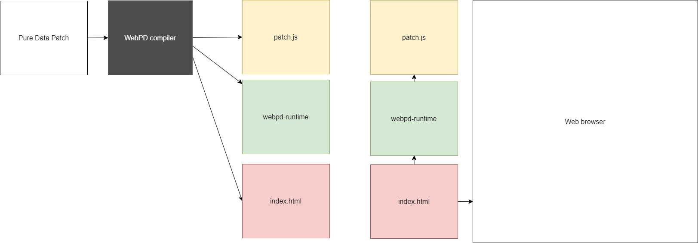
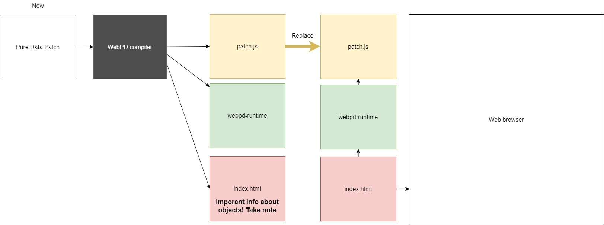

# Introduction to WebPD

In these two workshops, you will learn how to integrate Pure Data audio systems into web applications using WebPD. The sessions will cover basic web development principles, like Javascript, CSS, HTML, and the Document Object Model (DOM) before we set up local development environments and use WebPD to build browser-based audio web applications.

The goal is to learn more about how to set up and configure advanced technologies for synchronous and asynchronous online musical collaboration.
In class, we will explore examples together, with increasing complexity, that demonstrate how we can start to build complex audio DSP web apps using WebPD. With each example, several acitivities follow.

**NB!** This workshop requires an intermediate level of familiarity with Pure Data and the DOM-model.

## Preperation

- [JavaScript Tutorial for Beginners: 1 hour](https://www.youtube.com/watch?v=W6NZfCO5SIk)
- [Introduction to the DOM](https://developer.mozilla.org/en-US/docs/Web/API/Document_Object_Model/Introduction)
- Familiarize yourself with [WebPD](https://github.com/sebpiq/) and the [WebPD online compiler](https://sebpiq.github.io/WebPd_website/)

## Dependencies

- Visual Studio Code with the Live Server extension installed
- A Chromium-based browser (Chrome, Brave, Vivaldi, etc.)
- Pure Data vanilla

## Our WebPD Workflow

Basic workflow:

1. Build a pure data patch
2. Upload to WebPD online compiler: https://sebpiq.github.io/WebPd_website/?target=app&build=1
3. download the contets.
4. If you have downloaded contents from before, replace the "patch.js" in this folder with your new downloaded "patch.js"
5. Take note of the PD parameters (nodeID, portletID, message) inside the "index.html".
6. Add your custom javaScript in the "index.js" file.

 
 

## Resources

- [How To Add CSS to your page](https://www.w3schools.com/CSS/css_howto.asp)
- [w3school of coding](https://www.w3schools.com/)
- [Mozilla Developers HTML docs](https://developer.mozilla.org/en-US/)
- WebPD docs : https://github.com/sebpiq/WebPd?tab=readme-ov-file
